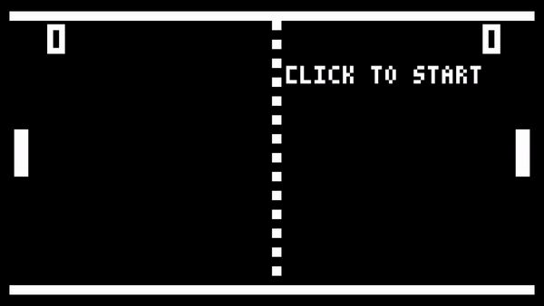

# Pong with Processing
## About the author
Miguel Herrera Álvarez. Last-year Computer Engineering student in the University of Las Palmas de Gran Canaria.

## Develop
Try to remake original Pong game using Processing for it developt.
The code consist in a _setup()_ method where initialice all the variables and a _draw()_ method which call other auxiliar methods who paint the frame and handler the movements and bounds. Most interesting of this methods are which handler bounds, in this case _contactWithPlayer()_ control the bound of the ball with a player's paddle.

### Decisions
- Player 1 controls:
    - W key for up.
    - S key for down.
- Player 2 controls:
    - ↑ key for up.
    - ↓ key for down.
- Win score is 10 goals.

## Tools and references
- [Processing 3.5.4](http://processing.org/)
    - Processing.Sound library
- [Bit 5x3 Font](https://www.mattlag.com/bitfonts/)

## Take a peek of result

